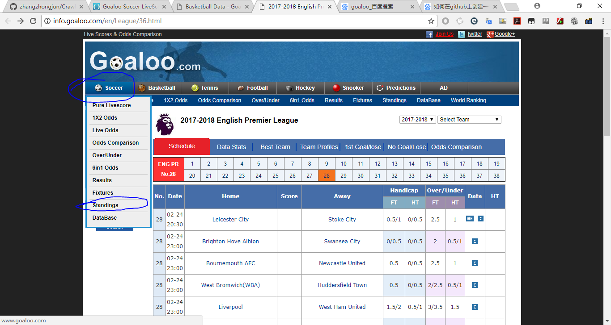

# goaloo.com的爬虫
该项目是为了爬取所有联赛（League）、子联赛（SubLeague）、杯赛（CupMatch）的比赛结果，联赛结果的入口如下图所示，网址为： http://info.goaloo.com/en/League/36.html 

## 获得所有的联赛中的所有的杯赛、联赛和子联赛 的链接
http://info.goaloo.com/jsData/leftData/leftData.js 可以得到左侧所有的数据，即所有的联赛、杯赛、子联赛
http://info.goaloo.com/Script/en/leftOther_en.js 中的Generate函数描述了如何使用leftData
* leftData中定义了arrArea数组
* arrArea[0] arrArea[1] arrArea[2] arrArea[3] arrArea[4] arrArea[5] arrArea[6]分别代表了洲际赛事、欧洲赛事、美洲赛事、亚洲赛事、大洋洲赛事、非洲赛事
* 以arrArea[0]为例，arrArea[0]是一个数组，里面存放着并列的几个数组，每个数组代表一个国家，记arrGuo=arrArea\[0\]\[0]。
* arrGuo[0] arrGuo[1] arrGuo[2] arrGuo[3] arrGuo[4] arrGuo[5]分别代表该国中文简体名、该国中文繁体名、该国英文名、不明意义的数字、该国所有联赛、该国所有杯赛
* 记arrLea=arrGuo[4] ，arrLea[0]代表编号，arrLea[1]代表联赛或子联赛的中文简体名，arrLea[2]代表联赛或子联赛的中文繁体名，arrLea[3]代表联赛的英文名，arrLea[4]=0表示该记录是联赛、1表示是子联赛
* 记arrCup=arrCup[5]，arrCup[0]代表编号，arrCup[1]代表杯赛的中文简体名，arrCup[2]代表杯赛的中文繁体名，arrCup[3]代表杯赛的英文名，arrCup[4]固定为2

## 处理杯赛

http://info.goaloo.com/jsData/LeagueSeason/sea杯赛编号.js 获得该杯赛的所有赛季
http://info.goaloo.com/jsData/matchResult/赛季/c75_en.js?version=2018021823 获得该杯赛在该赛季下的所有的比赛结果

## 处理联赛
http://info.goaloo.com/jsData/LeagueSeason/sea杯赛编号.js 获得该联赛的所有赛季
http://info.goaloo.com/jsData/matchResult/赛季/s36_en.js?version=2018021823 获得该联赛在该赛季下的所有的比赛结果

## 处理子联赛
1. http://info.goaloo.com/en/SubLeague/297.html 先从这个页面提取第一个子联赛的url
2. http://info.goaloo.com/jsData/matchResult/2017-2018/s297_188_en.js?version=2018021823 中的arrSubLeague获取所有的子联赛信息，包括子联赛编号、子联赛名等
3. 构造出所有子联赛的url，获取所有子联赛的信息